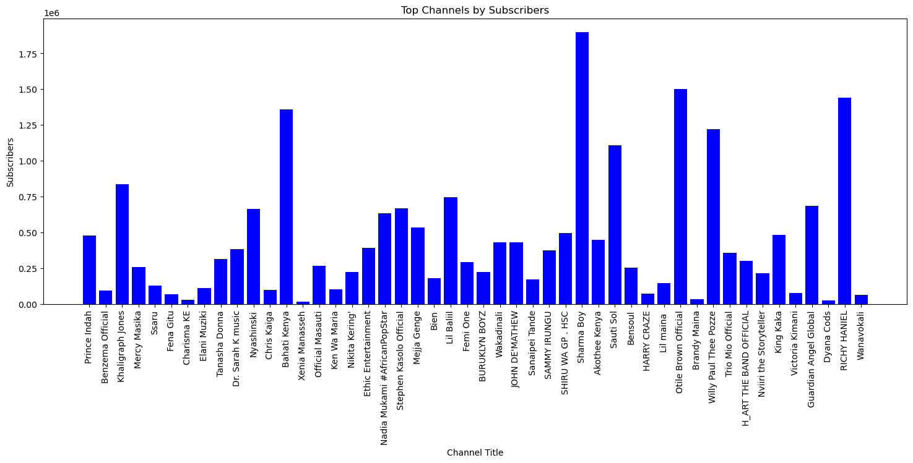
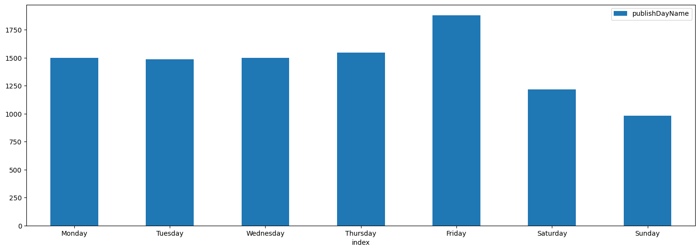
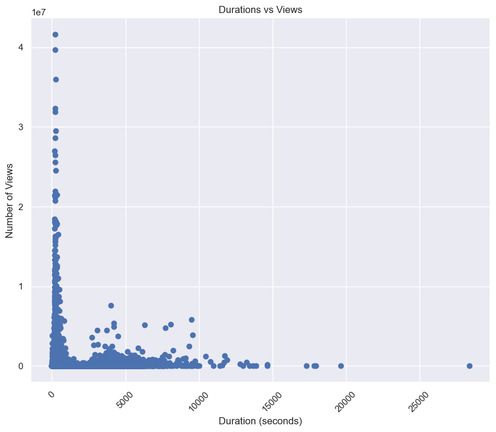

# Overview

YouTube is a search engine owned by Google mainly used as an online video sharing platform. It has more than 2.7 billion monthly users, as of January 2024 according to Wikipedia. 
This is a project to analyze Kenyan YouTube channels using python and the YouTube API keys. For the specific channels, I hand selected top rated musicians in Kenya, no basic order. This is what is in 'YouTube_APIS.ipynb' file and could be essential with a targeted channels. 'Youtube_api_Scrap.py' file uses keyword Kenya, that is, it scraps all channels with Kenya, KE, Ke and ke as a Keyword. 
This will involve gathering data from YouTube, processing and analyzing it with the primary goal to gather video statistics, channel information, and perform various analyses to understand trends, performance metrics, and other key insights.

## Features

* YouTube Data Scraping: Extract information about videos, channels, and playlists from YouTube.

* Data Cleaning: Process and clean the scraped data to ensure accuracy.

* Exploratory Data Analysis (EDA): Analyze and visualize data to uncover trends, patterns, and insights.

* Visualization: Generate charts and graphs to represent various metrics and performance indicators.

## Tools and configuration

* Python
* YouTube Data API - API key 
* google-api-python-client - for accessing Youtube Data API
* Pandas and numpy
* Matplotlib and Seaborn - for visualization
* YouTube API key - to access the youtube API from the [Google Developers Console](https://developers.google.com/youtube/v3/getting-started)


## File Structure

- 'YouTube_APIS.ipynb' - script to the scraped youtube data which yields 
1. kenyan_youtube_data.csv; has more coplex information of individual videos of each channel, like views, comment count and publishdates

2. Kenyan_youtube2.csv; contains general channel information like channelName, subscribers,	views, totalVideos and playlistId


- 'Youtube_EDA.ipynb' - script for the cleaning process for EDA. This yields updated_kenyan_youtube_data.csv; which is clean data ready for visualization and further insights.

- 'Youtube_APIs.py' - python script that has tests of other possible ways to carry out the scraping activity.

## Data Cleaning Process (kenyan_youtube_data.csv file)

* The publishedAt column has string date and time, we convert it to actual datetime
We get the exact day of week each video is published
```python
df['publishedAt'] =  df['publishedAt'].apply(lambda x: parser.parse(x)) #to a datetime data type
df['pushblishDayName'] = df['publishedAt'].apply(lambda x: x.strftime("%A")) #to day of week
```

* The duration column has a string type format so we change to seconds, as a timedelta object form of seconds. one could do days but I like seconds for the visualization I wish to do later on.
```python
df['durationSecs'] = df['duration'].apply(lambda x: isodate.parse_duration(x))
df['durationSecs'] = df['durationSecs'] .astype('timedelta64[s]')
```

* got rid of data that seemed unneccessary statistically
In two different ways.

```python
df.drop(columns=['favouriteCount'], inplace=True) #drpped the column

df = df[df['channelTitle'] !='RicoGangVEVO']# deleted any row containing information on RicoGangVEVO
```

* some channels had slight differences; here is a sample of one of the updates

```python
df = df.copy() # a copy of the dataset to address the setting with copy warning since this is a sample of the dataframe
df.loc[:, 'channelTitle'] = df['channelTitle'].replace({  #loc makes sure we use the set dataframe safely
    'ChrisKaigaVEVO': 'Chris Kaiga',
    'VictoriaKimaniVEVO': 'Victoria Kimani',
    'SautiSolVEVO': 'Sauti Sol',
    'EthicEntVEVO': 'Ethic Entertainment',
    'NikitaKeringVEVO': 'Nikita Kering\''
})
```

* check each column containing nulls for easy updating


```python
df_n = df[df['totalVideos'].isnull()]
#df_n = df[df['playlistId'].isnull()]
#df_n = df[df['channelName'].isnull()]
unique_titles = df_n['channelTitle'].unique()
unique_titles
```

## Exploratory data analysis

For the EDA, the objectives were;

* Show objectives by subscribers
```python
plt.bar(dataframe['channelTitle'], dataframe['subscribers'], color='blue')
plt.title('Top channels by subscribers')
plt.xlabel('Channel Title')
plt.ylabel('Subscribers')
plt.xticks(rotation=90)
plt.show()
```



* day of the week that most uploads are made

```python
day_df = pd.DataFrame(dataframe['publishDayName'].value_counts())
weekdays = [ 'Monday', 'Tuesday', 'Wednesday', 'Thursday', 'Friday', 'Saturday', 'Sunday']
day_df = day_df.reindex(weekdays)
ax = day_df.reset_index().plot.bar(x='index', y='publishDayName', rot=0)
```



* length of video vs viewcount

the shorter the video, the more the views
```python
plt.scatter(dataframe['durationSecs'], dataframe['viewCount'])
plt.title('Durations vs Views')
plt.xlabel('Duration (seconds)')
plt.ylabel('Number of Views')
plt.xticks(rotation=45)
plt.show()
```




# Data limitation

The channel selection was based on my knowledge not any specific process/ metric used.


## Extra data

'kenyan_youtube_channelsstats.csv' and 'kenyan_youtube_channelspy.csv'are products of the .py file. 
EDA coming soon in sql script file - 'Youtube_api_EDA.sql'